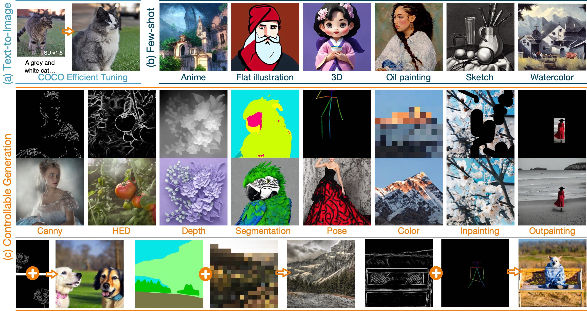

<p align="center">

  <h2 align="center">SCEdit: Efficient and Controllable Image Diffusion Generation via Skip Connection Editing</h2>
  <h3 align="center">(CVPR 2024 Highlight)</h3>
  <p align="center">
    <strong>Zeyinzi Jiang</strong>
    ·
    <strong>Chaojie Mao</strong>
    ·
    <strong>Yulin Pan</strong>
    ·
    <strong>Zhen Han</strong>
    ·
    <strong>Jingfeng Zhang</strong>
    <br>
    <b>Alibaba Group</b>
    <br>
        <a href="https://arxiv.org/abs/2312.11392"></a>
        <a href='https://scedit.github.io/'></a>
        <a href='https://github.com/modelscope/scepter'></a>
        <a href='https://github.com/modelscope/swift'></a>
    <br>
  </p>
  
  <table align="center">
    <tr>
    <td>
      
    </td>
    </tr>
  </table>

SCEdit is an efficient generative fine-tuning framework proposed by Alibaba TongYi Vision Intelligence Lab. This framework enhances the fine-tuning capabilities for text-to-image generation downstream tasks and enables quick adaptation to specific generative scenarios, **saving 30%-50% of training memory costs compared to LoRA**. Furthermore, it can be directly extended to controllable image generation tasks, **requiring only 7.9% of the parameters that ControlNet needs for conditional generation and saving 30% of memory usage**. It supports various conditional generation tasks including edge maps, depth maps, segmentation maps, poses, color maps, and image completion.

## News

* **[2023.12.29]** Official implementations: code and models have been made public on [🪄SCEPTER](https://github.com/modelscope/scepter) library.
* **[2023.12.28]** Integrate into the [SWIFT](https://github.com/modelscope/swift)(Scalable lightWeight Infrastructure for Fine-Tuning) library.
* **[2023.12.18]** We propose [SCEdit](https://arxiv.org/abs/2312.11392), an efficient and controllable generation framework.

## Usage

For a complete implementation, please refer to [🪄SCEPTER](https://github.com/modelscope/scepter).
- Installation
```shell
git clone https://github.com/modelscope/scepter.git
```
- Text-to-Image Generation
```shell
# SD v1.5
python scepter/tools/run_train.py --cfg scepter/methods/scedit/t2i/sd15_512_sce_t2i.yaml
# SD v2.1
python scepter/tools/run_train.py --cfg scepter/methods/scedit/t2i/sd21_768_sce_t2i.yaml
# SD XL
python scepter/tools/run_train.py --cfg scepter/methods/scedit/t2i/sdxl_1024_sce_t2i.yaml
```
- Controllable Image Synthesis
```shell
# SD v1.5 + hed
python scepter/tools/run_train.py --cfg scepter/methods/scedit/ctr/sd15_512_sce_ctr_hed.yaml
# SD v2.1 + canny
python scepter/tools/run_train.py --cfg scepter/methods/scedit/ctr/sd21_768_sce_ctr_canny.yaml
# SD XL + depth
python scepter/tools/run_train.py --cfg scepter/methods/scedit/ctr/sdxl_1024_sce_ctr_depth.yaml
```
- Gradio
```shell
python -m scepter.tools.webui
```
We release an independent implementation of SCEdit under [SCEPTER](https://github.com/modelscope/scepter), which aims to provide developers with greater flexibility when working with SCEdit. Additionally, for rapid integration, kindly refer to our implementation of SCEdit in [SWIFT](https://github.com/modelscope/swift), specifically within the [scetuning_components](https://github.com/modelscope/swift/blob/main/swift/tuners/scetuning/scetuning_components.py). 
- Installation
```shell
pip install ms_swift
```
- Training
```python
from swift import Swift, SCETuningConfig
model = ...
tuner_config = SCETuningConfig(
    dims=[1280, 1280, 1280, 1280, 1280, 640, 640, 640, 320, 320, 320, 320],
    target_modules=r'^unet\.up_blocks\.\d+\.resnets\.\d+$') # for diffusers library
model = Swift.prepare_model(model, tuner_config)
print(model.get_trainable_parameters())
```

## BibTeX

```bibtex
@article{jiang2023scedit,
    title = {SCEdit: Efficient and Controllable Image Diffusion Generation via Skip Connection Editing},
    author = {Jiang, Zeyinzi and Mao, Chaojie and Pan, Yulin and Han, Zhen and Zhang, Jingfeng},
    year = {2023},
    journal = {arXiv preprint arXiv:2312.11392}  
}
```
